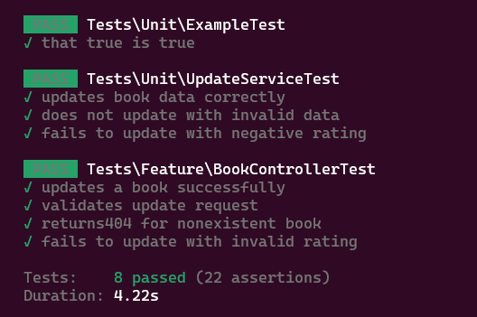
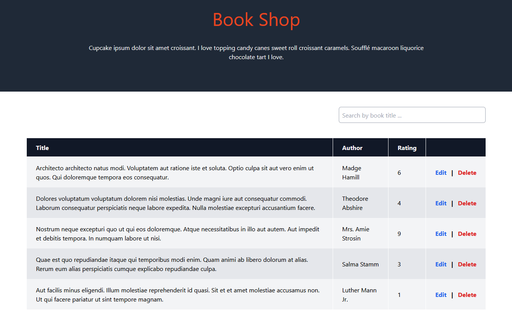
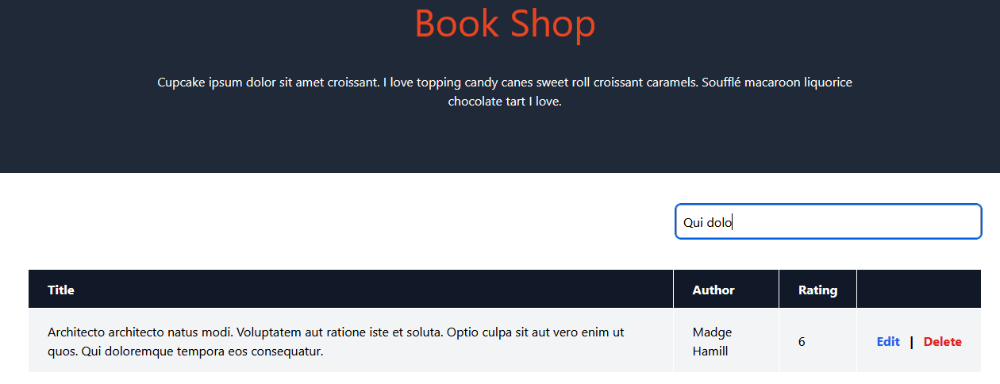
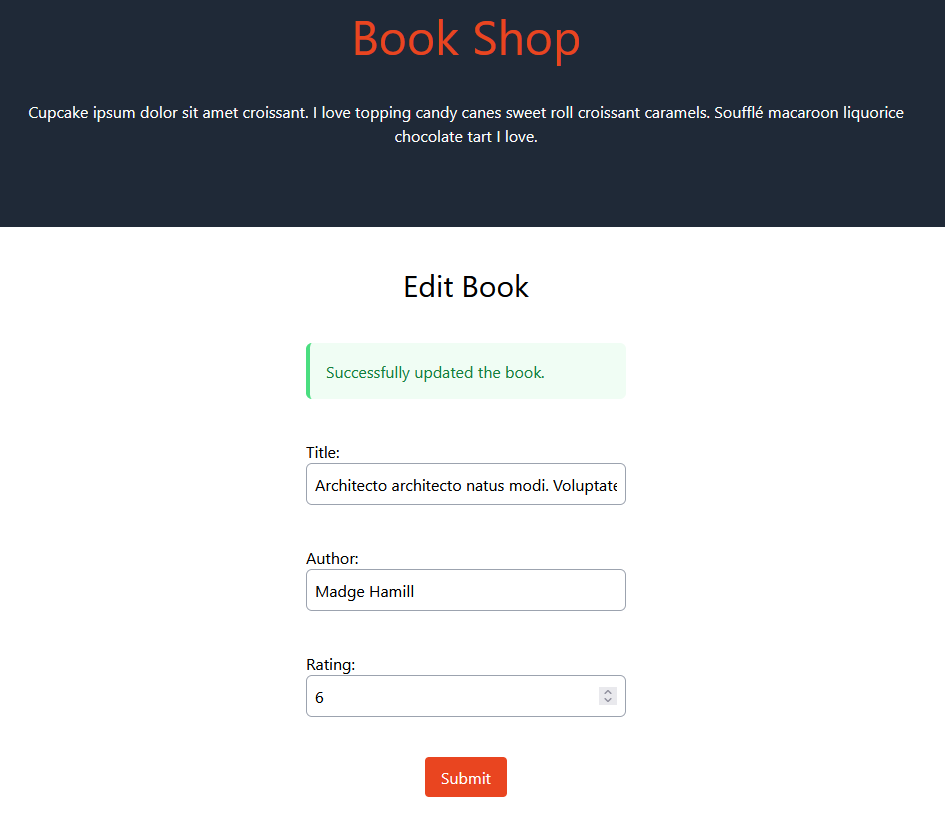

## Application Boot

- ```composer install```
- ```cp .env.example .env```
- ```php artisan key:generate```
- ```./vendor/bin/sail up -d```
- ```./vendor/bin/sail artisan test```
- ```./vendor/bin/sail artisan migrate:fresh --seed```
- ```./vendor/bin/sail npm install```
- ```./vendor/bin/sail npm run prod```

## Tests



## PostMan

- GET Genres
```
curl --location 'http://127.0.0.1/api/genres' \
--header 'Cookie: XSRF-TOKEN=eyJpdiI6ImN0M1lSRlpvZEo0L1hCckJDRDFmcGc9PSIsInZhbHVlIjoiNWV3V2k3Y2tqQnVoNGpZdWwwRStNNkN4N3oxejhwVmJ0RndJR09oSFhSNlZhWE85VHVJMmx4Y1IvV25LRVBoR0lPbEtHamYycmxRa25BVDY0VHZuWSs1VmtUTlZXZDZEMnIzbjhRY2NvRGpVZTc4Y3Z4bTZpOVZsOS9seHJxeU8iLCJtYWMiOiI2Y2MxNGFjNmUxMTdhYWRjZmE4MzFkYzhkMDMyYzEwMWJlZDZjNDFlN2M1M2I3ZWY1MjAzZmU4MjdkODNlNjE2IiwidGFnIjoiIn0%3D; laravel_session=eyJpdiI6IjJIQmxRMk1tUFYzbG5QQ1BJeTRQNXc9PSIsInZhbHVlIjoib3o0eU1wdVh0eW1kRTk3dGY5WFVvd2JzVG9TekcxR3BDVE1Qd1FEZEtmSkpvbzdtc2kyL3RpcGhid0dKdmxyTmN4c3BKVDI0VEN0U1dNTE5WaS9iUEJrc08xcHN5cXJJODVQeVA4bmJsNTYzY3R0cGhlU1E4MVpWTHg3UmN3a0oiLCJtYWMiOiI5ZTA1ZWIxMGViOTUxOTNkNzc1MjM3ZDNkNTlhZWI5MWY4OGM0MDIyMjVmODg5YmIzMmFlZmE2NTdiMWUxMWI1IiwidGFnIjoiIn0%3D'
```

- POST Genre
```
curl --location 'http://127.0.0.1/api/genres' \
--header 'Cookie: XSRF-TOKEN=eyJpdiI6ImN0M1lSRlpvZEo0L1hCckJDRDFmcGc9PSIsInZhbHVlIjoiNWV3V2k3Y2tqQnVoNGpZdWwwRStNNkN4N3oxejhwVmJ0RndJR09oSFhSNlZhWE85VHVJMmx4Y1IvV25LRVBoR0lPbEtHamYycmxRa25BVDY0VHZuWSs1VmtUTlZXZDZEMnIzbjhRY2NvRGpVZTc4Y3Z4bTZpOVZsOS9seHJxeU8iLCJtYWMiOiI2Y2MxNGFjNmUxMTdhYWRjZmE4MzFkYzhkMDMyYzEwMWJlZDZjNDFlN2M1M2I3ZWY1MjAzZmU4MjdkODNlNjE2IiwidGFnIjoiIn0%3D; laravel_session=eyJpdiI6IjJIQmxRMk1tUFYzbG5QQ1BJeTRQNXc9PSIsInZhbHVlIjoib3o0eU1wdVh0eW1kRTk3dGY5WFVvd2JzVG9TekcxR3BDVE1Qd1FEZEtmSkpvbzdtc2kyL3RpcGhid0dKdmxyTmN4c3BKVDI0VEN0U1dNTE5WaS9iUEJrc08xcHN5cXJJODVQeVA4bmJsNTYzY3R0cGhlU1E4MVpWTHg3UmN3a0oiLCJtYWMiOiI5ZTA1ZWIxMGViOTUxOTNkNzc1MjM3ZDNkNTlhZWI5MWY4OGM0MDIyMjVmODg5YmIzMmFlZmE2NTdiMWUxMWI1IiwidGFnIjoiIn0%3D' \
--form 'name="test genre 1"'
```

- POST Genre/Book
```
curl --location 'http://127.0.0.1/api/genres/1/books' \
--header 'Content-Type: application/json' \
--header 'Cookie: XSRF-TOKEN=eyJpdiI6IkRXQ1pWeW1ZdjRhcDdHUGhXcnRwN1E9PSIsInZhbHVlIjoiOEQ1d1VkczlDOUFLOHBLZ1k4ODUzTFBRcVNNK0VWbWlkemhVOHdaSWlFSHN5cjg0bElVYitvR0YzUnIwb1R1SkdRUGsxRzYxN1crRDlqK2hSc1Y1S0JrQWhqc2E3NDJWTCtTRXFpT1JFMlVaNTNXM2N2TDhNQUZMNjVkWnlKS3ciLCJtYWMiOiJjN2Q3ZmVmOGY5YzdmMDI5Y2Q4NWMyMTExNjNhNDBmNDE3OTkyMmI3ZWIzM2I2ZjM2NmIyNzZmMjg5MDhhMGEzIiwidGFnIjoiIn0%3D; laravel_session=eyJpdiI6IllZSy9ucy9tVmYxNVpaaUtORXRMYnc9PSIsInZhbHVlIjoiVkIzaXVQVnkwckJXdHNTdkJEOU9RNFVwRVFoREU3cThzVmlsUUp4MzJTUEpraTJFSnNVT3dNZCt0aGhPK3NDb0htb2M3WkFScWRhcnlwRzAzS2lDbFp2dHFjUXV1VUpLVUhLOVV2cUVvZGdYQ1dLeTQ3ZnBNQm1TYTdHTWE3c2giLCJtYWMiOiJkNzU1YmI3N2NhOGM3NTM4NmYxNzJmOTY0NDVmYTlkZDY2MjA5NmFkZDc2NGEzOWRhYWIwNTk5Y2JhNDc5NjM5IiwidGFnIjoiIn0%3D' \
--data '{
    "book_ids": [1, 2, 3]
}'
```

## UI

- http://localhost/books




